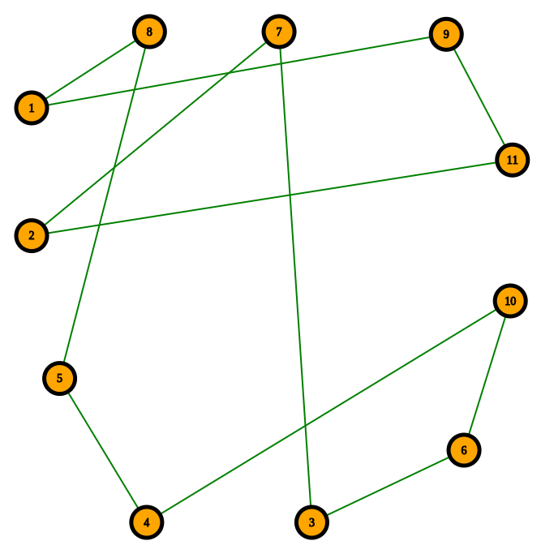

# TSPcode
* Code for Tsp
* The minn.cpp is the code for Travelling sailsmen problem
* In the code I have recorded the optimal path of the Sailsmen problem and minimum cost of the optimal path.
* In the code I have fixed the node numbers to the city names in USA
```C
  1-> Amsterdam
  2->New York
  3->Hudson
  4->Middletown
  5->Mechanicville
  6->Rochester
  7->Kingston
  8->Norwich
  9->Niagara Falls
  10->Jamestown
  11->Cortland
 ```
* At first compile the code "g++ minn.cpp"
* And Run the code "./a.out"
* the output u will get is the minimun cost of the optimal path and path will be printed in both numbers and the names in the path.
* And I hard coded the edge weights between each nodes. and I have matrix for that in code.
* The matrix is 
```C
           1	2	3	4	5	6	7	8	9	10	11	
1	INF	  29	  20	  21	  16	  31	 100	  12	   4	  31	  18	
2	  29	INF	  15	  29	  28	  40	  72	  21	  29	  41	  12	
3	  20	  15	INF	  15	  14	  25	  81	   9	  23	  27	  13	
4	  21	  29	  15	INF	   4	  12	  92	  12	  25	  13	  25	
5	  16	  28	  14	   4	INF	  16	  94	   9	  20	  16	  22	
6	  31	  40	  25	  12	  16	INF	  95	  24	  36	   3	  37	
7	 100	  72	  81	  92	  94	  95	INF	  90	 101	  99	  84	
8	  12	  21	   9	  12	   9	  24	  90	INF	  15	  25	  13	
9	   4	  29	  23	  25	  20	  36	 101	  15	INF	  35	  18	
10	  31	  41	  27	  13	  16	   3	  99	  25	  35	INF	  38	
11	  18	  12	  13	  25	  22	  37	  84	  13	  18	  38	INF
```
* INF is the maximum number in int
* Actual we should give 0 for (1,1) but as here we are computing minimum we should not have a self loop so we take it as INF.
* The actual graph is this:

* After running the code the optimal path graph is this:

